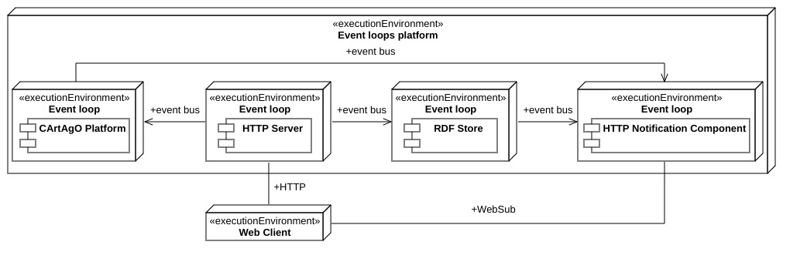

# Architecture

This file is documenting the architecture of the "Yggdrasil" project.

## Bird's eye view

### Context

Yggdrasil is a platform for creating "Multi-Agent Systems" environments with "hypermedia" properties, so properties typical of the Web.
The "Agents & Artifact" meta-model is the base for the MASes the platform creates. The agents are the active, goal-oriented components. The artifacts are the passive components, encapsulating those parts of the system needed by the agents. It means they can be an interface to some physical or virtual resources and model communication or coordination abstractions. They compose the "environment" of a MAS, so Yggdrasil lets you interact with artifacts and only those.
The "hypermedia" properties implemented are multiple. Everything in the system is a resource, so a uniform identifier is available for each. Then, semantic relations exist between those resources to be crawled by anyone. The system has a single entry point, the MAS identifier, from which all the others descend. Then, starting from it, all agents navigating the system can discover what is in and how to interact with it, minimizing the coupling between entities of the MAS.
**Architecture invariant**: all hypermedia properties need to be preserved, from the architecture to the implementation to the dependencies of this project.

### Practical use

On a more grounded description, Yggdrasil creates a web service for handling the environment of a MAS, exposing a ReST API for doing so while managing all the desired functionalities. It can represent the different environments, the workspaces in each of them, and the artifacts in each workspace. Users of the system, so agents, can then make HTTP requests to the API to interact with the environments, specifying the representation of what they want to create or update via JSON or Turtle triples.
It also contains an implementation of the ["WebSub" protocol](https://www.w3.org/TR/websub/). This protocol allows the system to notify listeners about everything that happens in itself in a reactive, non-blocking, Web-standardized way. Registering using the WebSub protocol also allows Yggdrasil to inform agents of environmental changes.

## Codemap

### Modules

There are four main modules at play in this project. Each contains a component running in its own "event loop," capable of receiving information from others via "events" - read "messages" - onto an "event bus." An event bus is then a shared communication channel between all event loops.
**Architecture invariant**: all the modules must be as decoupled as possible so they cannot communicate directly and synchronously via method calls. They must communicate in an indirect, asynchronous fashion using message passing.

#### `http` package

This package contains the "HTTP Server" module, so the HTTP Server that external Web Clients can contact. It exposes the functionalities of the web service through dedicated routes. The routes are in the "HttpServerVerticle" class, while their associated behavior is in the "HttpEntityHandler" class.
The server allows the client to create, update, delete, and get environments, workspaces in those environments, and artifacts in those workspaces. For each request, it issues the corresponding operation on the "CArtAgO" component. After its completion, it can create, serialize, and send the representation of the involved entity to the "RDF Store" component.
Between the other functionalities, there is one for registering for notifications through the "WebSub" protocol, registration aptly notified from the HTTP Server to the "HTTP Notification" component.

#### `cartago` package

This package contains the "CArtAgO" module, handling the interactions with the CArtAgO platform to allow compatible agents and frameworks to interact with Yggdrasil. An example is the "JaCaMo" platform, which can connect to remote CArtAgO nodes, such as the one managed by this module, and let its agents interact with it.
The "CartagoEntityHandler" handles all the CArtAgO requests coming from the "HTTP Server" module, forwarding them appropriately to the "CartagoVerticle" class. This last one effectively implements the interplay between Yggdrasil and CArtAgO. This class allows workspace creation, artifact creation, and action invocation on artifacts: the operations part of  CArtAgO. These entities' construction also means generating their semantic representation as a response to the request to do it, which the "HTTP Server" component then routes to the "RDF Store."
All the artifacts created by Yggdrasil are instances of the "HypermediaArtifact" class. It exposes some methods to retrieve and set properties that are proper of "[thing descriptions](https://www.w3.org/TR/wot-thing-description11/)," such as their action affordances, security schemes, et cetera. To keep track of all the artifacts created without passing from CArtAgO, a "HypermediaArtifactRegistry" is used. This registry also handles all the secondary operations, such as getting and setting prefixes, names, and API keys for different entities.
This module is also capable of handling the percepts observation. The module continually listens to the CArtAgO platform for new signals or observable property updates and forwards them to the "HTTP Notification" module to inform its subscribers.
The only thing this module does not handle is the environment creation because this is not a CArtAgO feature but is an extension brought by Yggdrasil.

#### `store` package

This package contains the "RDF Store" module. It is responsible for storing the semantic representations of the environments, the workspaces, and the artifacts. Yggdrasil uses the ["Thing Description" ontology](https://www.w3.org/2019/wot/td) to represent these entities. This "knowledge" representation and storage allows agents to crawl the MAS semantically, realizing the "semantic relations" and the single entry-point principle described above.
The "RdfStoreVerticle" activates in response to events from the "HTTP Server" module, which events ask to get, create, update, or delete their designated entity. The class forwards the requests to the store, effectively represented by the "RdfStore" interface and its "Rdf4jStore" implementation. After a creation, update, or deletion operation succeeds, the store sends an event to the "HTTP Notification" module to alert all its subscribers. It is also responsible for generating the IRIs of the resources stored and serializing and deserializing the knowledge graphs kept inside of itself.

#### `websub` package

This package contains the "HTTP Notification" module. It sends real-time notifications about artifacts' observable property updates or signal firings, as requested by the CArtAgO component. It also sends alerts about changes in the system state, such as entity creations, deletions, and updates, as requested by the HTTP Server component. The class implementing this functionality is the "HttpNotificationVerticle" one. This module implements the ["WebSub" protocol](https://www.w3.org/TR/websub/) for sending notifications to subscribers, a web recommendation for publish-subscribe communication over the Web. A registry of all subscribers is then needed, and the "NotificationSubscriberRegistry" class contains it.
